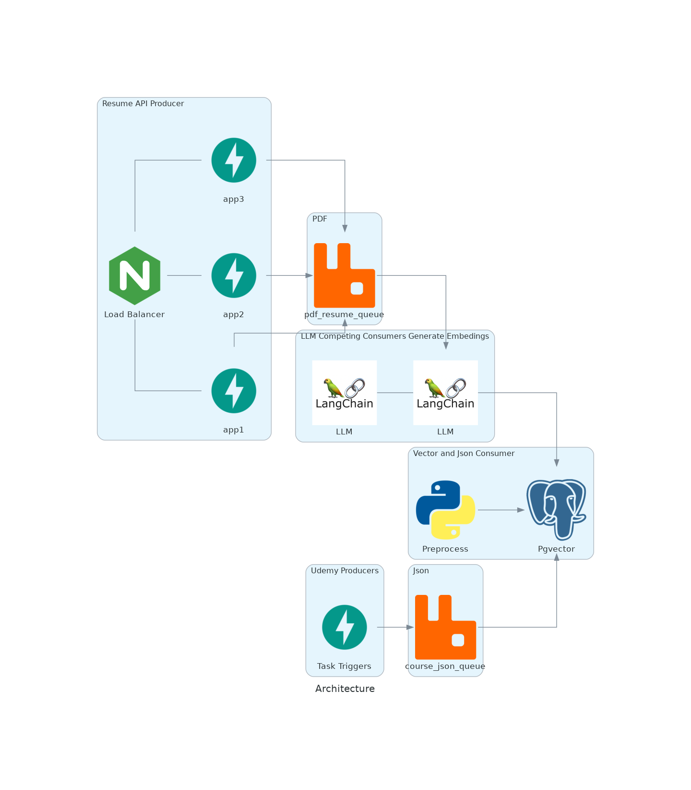

# ghost-me.ai
#### To Run
    cd ghostme
    
    docker-compose up -d 



### Sample workflow:
```python 
import requests 

api_url = "http://localhost:8080"
user_data = {"username": "example_user", "password": "example_password"}
file_path = "path/to/pdf"
```

#### Sign up and log in to obtain a jwt token (expires after 30 min)
```python 
def register_user() -> None:
    response = requests.post(f"{api_url}/users/", json=user_data)
    response.raise_for_status()
    print("User registration response:", response.text)

def get_token() -> str:
    response = requests.post(f"{api_url}/login/", json=user_data)
    response.raise_for_status()
    token_data = response.json()
    print("Login response:", token_data)

    return token_data

def send_upload_file_request(jwt_token: str):
    files = {"file": ("file.pdf", open(file_path, "rb"), "application/pdf")}
    headers = {"Authorization": f"Bearer {jwt_token}"}
    response = requests.post(f"{api_url}/uploadfile/", files=files, headers=headers)

    print(f"Status Code: {response.status_code}")
    print(f"Response Body: {response.text}")
```

#### All together:
```python
def main() -> None:
    register_user()
    token_data = get_token()
    jwt_token = token_data.get("access_token", "")
    send_upload_file_request(jwt_token)
```
#### Expected final response:
    Response Body: {"message":"File uploaded successfully"}


A user only has to register once so that can be removed is subsequent runs.