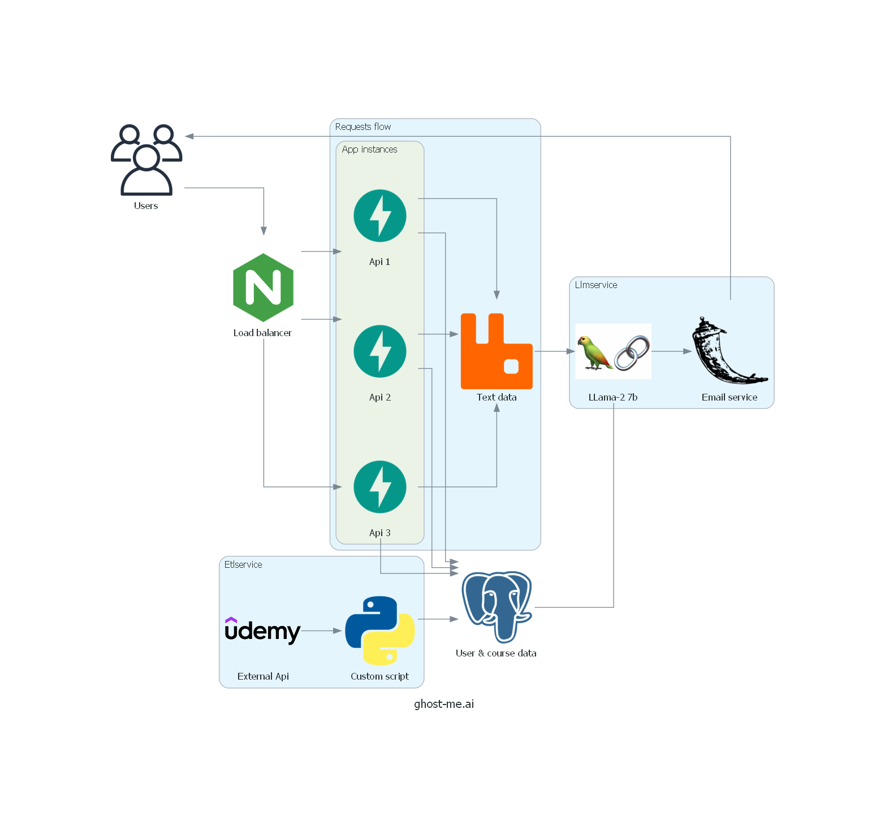

# ghost-me.ai

{: .center}
## Goal
The main goal of this project is to combat ghosting i.e. 
not getting a reply after applying to a job opening. The idea is
to use a llm to respond to an already declined candidate with some
course recommendations to improve for the future.


### To run
    cd ghostme
    
    docker-compose up -d --scale app=3

### Architecture


The project is quite expensive on the machine mostly due to llama-2. I hardcoded cpu but it can be changed to gpu. Demo is also located on: https://ghost-me-api.onrender.com


Currently, learning frontend, so it's on its way but for now you can use the class located in wrapper.py 
which uses requests to simplify interactions with the API through python

### Demo
```python
from wrapper import GhostWrapper
# GhostWrapper expects an email and password
# you can set local = True for the docker setup or leave it (default = False)
# to interact with https://ghost-me-api.onrender.com
ghost_service = GhostWrapper(email="random@email", password="random-password", 
                             registration_key="your key") # feel free to reach out for the online key

# simple registration
ghost_service.register()

# logs in and accesses the jwt token
jwt_token = ghost_service.get_access_token()

# sends data to the service
# only accepts PDFs
ghost_service.upload_data(
    jwt_token=jwt_token, file_path="path/to/file", job_description="random description"
)
# returns all data that was uploaded for that user
ghost_service.retrieve_uploaded_data(jwt_token=jwt_token)

# deletes the user and all of their uploaded data
ghost_service.delete(jwt_token=jwt_token)
```
